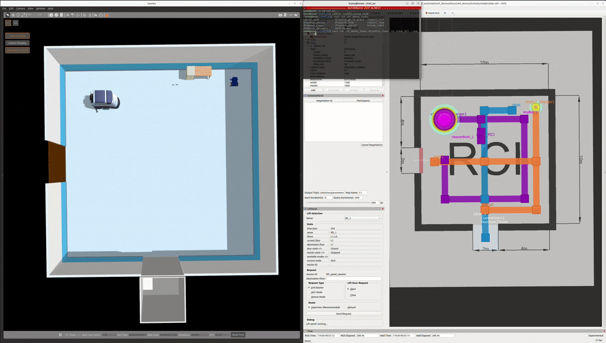

> This repository is a **fork** of [open-rmf/rmf_demos](https://github.com/open-rmf/rmf_demos),  
> based on the `2.0.3` tag.  
> All original demos are preserved, and additional worlds/code used for my own experiments are marked explicitly.

# RMF Demos


The Open Robotics Middleware Framework (Open-RMF) enables interoperability among heterogeneous robot fleets while managing robot traffic that share resources such as space, building infrastructure systems (lifts, doors, etc) and other automation systems within the same facility. Open-RMF also handles task allocation and conflict resolution  among its participants (de-conflicting traffic lanes and other resources). These capabilities are provided by various libraries in [Open-RMF](https://github.com/open-rmf/rmf).
For more details about Open RMF, refer to the comprehensive documentation provided [here](https://osrf.github.io/ros2multirobotbook/intro.html).

This repository contains demonstrations of the above mentioned capabilities of RMF. It serves as a starting point for working and integrating with Open-RMF.

[](https://vimeo.com/405803151)

#### (Click to watch video)

## System Requirements

These demos were built and tested on

* [Ubuntu 22.04 LTS](https://releases.ubuntu.com/22.04/)

* [ROS 2 - Humble](https://docs.ros.org/en/humble/Releases/Release-Humble-Hawksbill.html)

* [Gazebo Classic 11](http://gazebosim.org/tutorials?tut=install_ubuntu&ver=11)
> Note: RMF is fully supported on ROS 2 Foxy as well

## Installation

Official installation and background information for Open-RMF can be found [here](https://github.com/open-rmf/rmf).

This fork assumes the following environment:

- **Ubuntu 22.04**
- **ROS 2 Humble**
- **Gazebo Classic** (e.g., Gazebo 11)
- Open-RMF installed from **binary packages** on Humble

### 1. Install RMF binary packages (Humble)

If you have not installed Open-RMF on Humble yet:

```bash
sudo apt update
sudo apt install ros-humble-rmf-dev
```
a
### 2. Create a workspace and clone this repository
```bash
mkdir -p ~/rmf_ws/src
cd ~/rmf_ws/src
git clone https://github.com/agbread/rmf_demos.git
```

### 3. Install dependencies with rosdep
```bash
cd ~/rmf_ws
rosdep install --from-paths src --ignore-src -r -y
```

### 4. Build and source the workspace

```bash
cd ~/rmf_ws
colcon build
source install/setup.bash
```
 
## FAQ
Answers to frequently asked questions can be found [here](docs/faq.md).

## Roadmap

A near-term roadmap of the Open-RMF project can be found in the user manual [here](https://osrf.github.io/ros2multirobotbook/roadmap.html).

## RMF-Web

Full web application of Open-RMF: [rmf-web](https://github.com/open-rmf/rmf-web).

In order to interact with the default configuration of the web application, the `server_uri` launch parameter will need to be changed to `ws://localhost:8000/_internal`, for example,

```bash
ros2 launch rmf_demos_gz office.launch.xml server_uri:="ws://localhost:8000/_internal"
```

By specifying `server_uri`, the fleetadapter will update `rmf-web` `api-server` with the latest task and robot states. User can then monitor on-going states and initiate rmf task with an interactive web dashboard.

## Demo Worlds

The following demo worlds are available in this repository:

- Hotel World
- Office World
- Airport Terminal World
- Clinic World
- Campus World
- Manufacturing & Logistics World
- RCI Lab World  <!-- added in this fork -->

Except for the **RCI Lab World**, all of the above worlds are the original Open-RMF demos from
the upstream repository at tag `2.0.3`.  
For detailed descriptions, figures, and usage instructions of these original worlds,  
please refer to the upstream README:

https://github.com/open-rmf/rmf_demos/tree/2.0.3#demo-worlds

**RMF Panel**


Click this link: https://open-rmf.github.io/rmf-panel-js/

> For a full-proof web application of Open-RMF, please refer to [rmf-web](https://github.com/open-rmf/rmf-web).

The [RMF panel](https://github.com/open-rmf/rmf-panel-js) is a web based dashboard for interacting with rmf_demos. It allows users to send task requests to RMF and monitor the status of robots and submitted tasks. For more [details](rmf_demos_panel/README.md).

There are two main modes of submitting tasks to Open-RMF via the Panel:

1. Submit a Task: Used to submit a single task.
2. Submit a List of Tasks: Used to submit a batch of tasks. A `.json` file containing a list of tasks may be loaded via the `Choose file` button. Some example files are found in `rmf_demos_panel/task_lists`.

**LATEST UPDATE: Display Task States**

`task_state_updates` are now published via websocket. To display task states on `rmf-panel`, specify `server_uri:="ws://localhost:7878"` during ros2 launch. Example:
```
ros2 launch rmf_demos_gz_classic rcilab.launch.xml server_uri:="ws://localhost:7878"
```

This will let Open-RMF (websocket clients) to publish their states to port `7878`. In this case, rmf-panel's `api_simple_server` is the websocket server.

---

### RCI Lab World

> This world is an **additional** demo provided by this fork (not part of the upstream `open-rmf/rmf_demos`).

The **RCI Lab World** represents a simple two-storey lab environment inspired by the RCI robotics lab.  
It is designed to showcase multi-floor coordination using a single lift and multiple robot roles in a compact map.

- **Floors**
  - 2 levels (L1, L2)
- **Robots**
  - `deliveryRobot` – delivery-focused fleet
  - `cleanerBot` – cleaning-focused fleet
  - `tinyRobot` – small patrol robot
- **Infrastructure**
  - 1 lift connecting L1 and L2
  - 1 door per floor integrated with Open-RMF

In the screenshot below, the left panel shows the upper floor of the **RCI Lab World** running in Gazebo with one of the robots and lab furniture, while the right panel shows the corresponding 2D layout and routes in the `rviz` schedule visualizer and `traffic_editor` (waypoints, chargers, and paths for the robots):


#### Tested environment and RMF version

This demo uses the **same OS / ROS 2 / Gazebo setup** as described in the *System Requirements* section above.

For Open-RMF itself, this fork is based on the `2.0.3` tag and was tested with the **Humble** binary packages, installed via:

```bash
sudo apt update && sudo apt install ros-humble-rmf-dev
```

#### Demo Scenario
The following GIF shows an example of a **clean** task running in the RCI Lab World:


To launch the RCI Lab world and the schedule visualizer:

```bash
source ~/rmf_ws/install/setup.bash
ros2 launch rmf_demos_gz_classic rcilab.launch.xml

# Example: loop / patrol task
ros2 run rmf_demos_tasks dispatch_patrol -p loop1 loop2 -n 3 --use_sim_time
# Example: delivery task
ros2 run rmf_demos_tasks dispatch_delivery -p restaurant -ph coke_dispenser -d desk -dh coke_ingestor --use_sim_time
# Example: clean task
ros2 run rmf_demos_tasks dispatch_clean -cs clean_RCI --use_sim_time
```


